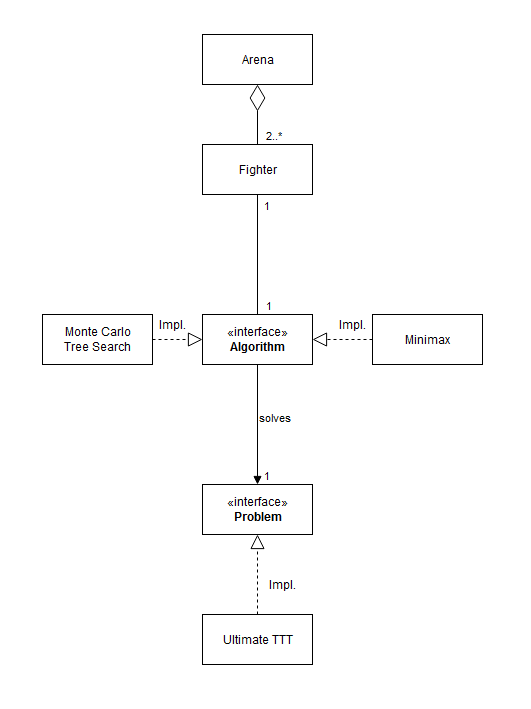

This repository compiles a group of algorithms and infrastructures used for the sake of resolving problems, and more specifically, the board game Ultimate Tic-Tac-Toe.  

Using Monte Carlo Tree Search as well as Minimax, in a framework of testing and iterative improving, it was possible to achieve a top 116 AI competing with the best of the best programmers in the site. 

`Ranking in Ultimate Tic Tac Toe out of over 5000 players:`

The framework used for the development and improvement of these algorithms is one where they are made to "fight" with eachother many many times in order to derive statistically significant information about which changes produce improvements. This is being done taking into account abstraction and interfaces, allowing an ease of addition of new algorithms to solve the same problem, or different problems to be solved by the same algorithms. 

`Infrastructure in use for abstraction and iterative improvement:`
 